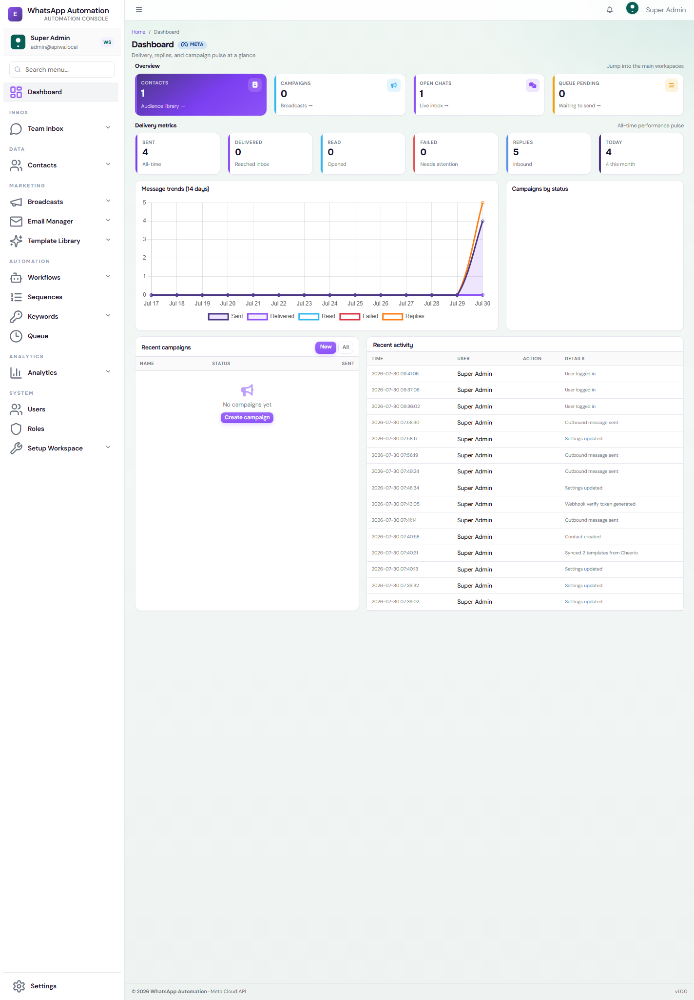
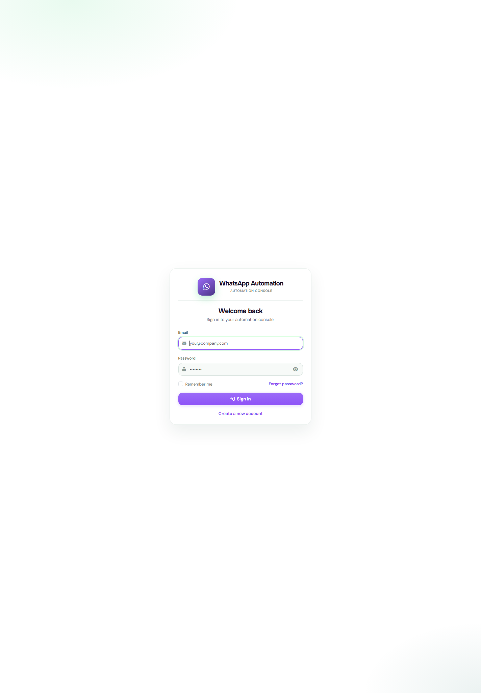

# Local Guide — Test on your PC (WAMP)

**Who this is for:** Beginners testing on a local computer  
**What you will do:** Run the app on WAMP, connect Cheerio WhatsApp, send and receive test messages  
**Time:** About 1–2 hours (first time)  
**Computer:** Windows with WAMP64  

> **Messaging provider:** This app uses **Cheerio Direct APIs only** — not Meta Graph API.  
> Primary Cheerio docs: [CHEERIO_FLOW.md](CHEERIO_FLOW.md) · [CHEERIO_CONFIGURATION.md](CHEERIO_CONFIGURATION.md) · [WEBHOOK_SETUP.md](WEBHOOK_SETUP.md)  
> API key: [https://app.cheerio.in/settings/apikey](https://app.cheerio.in/settings/apikey)

> **Tip:** Finish one step fully. Then go to the next step. Use the checklists.  
> For live customers on a real server, open the **Production** guide instead.

**Project folder:** `c:\wamp64\www\sateri_connect`  
**App link:** http://localhost/sateri_connect/public/

---

## Big picture


| Step | Do this | You are done when… |
|-----:|---------|---------------------|
| 1 | Start WAMP | Icon is green |
| 2 | Install app and login | Dashboard opens |
| 3 | Make a Cheerio WhatsApp app | https://app.cheerio.in |
| 4 | Copy token and IDs | You wrote 5 values in Notepad |
| 5 | Paste into Settings | Save works |
| 6 | Tunnel + webhook | Cheerio / WABA webhook verified |
| 7 | Sync templates | You see `hello_world` |
| 8 | Send and chat | Phone and Live Chat both work |

---

## What you need

| Item | Why |
|------|-----|
| WAMP64 | Runs the website (Apache + MySQL + PHP) |
| This project in `c:\wamp64\www\sateri_connect` | The app files |
| Cheerio account | To use Cheerio live WhatsApp |
| Your phone number | For test messages (OTP) |
| Internet | To talk to Cheerio |
| PowerShell or CMD | To run commands |

**You do not need:** paid hosting, Twilio, or a paid ngrok plan.  
We use a free Cloudflare tunnel for local testing.

---

# PART A — Run the app on your PC

## Step 1 — Start WAMP

1. Open **WAMP** from the Start Menu.  
2. Wait until the icon is **green**.  
3. Make sure **Apache** and **MySQL** (or MariaDB) are running.



### Checklist

- [ ] WAMP icon is green  
- [ ] http://localhost/ opens in the browser  

### If the icon is orange or red

- Left-click WAMP ? **Apache ? Service ? Start**  
- Left-click WAMP ? **MySQL ? Service ? Start**  
- If port 80 is busy, stop Skype or IIS, then try again.

---

## Step 2 — Check the project folder

Your folder should look like this:

```
c:\wamp64\www\sateri_connect\
  app\
  public\          ? open this from the browser
  writable\
  vendor\
  spark
  .env
  composer.json
```

Open this link:

```
http://localhost/sateri_connect/public/
```

- If you see **Install** ? go to Step 3.  
- If you see **Login** ? go to Step 4.

---

## Step 3 — Install the app (first time only)

Open:

```
http://localhost/sateri_connect/public/install
```

Follow each screen:

| Screen | What to enter |
|--------|----------------|
| Requirements | All items should be green |
| Database | Host `localhost`, user `root`, password empty (often), database name `sateri_connect` |
| App | Base URL: `http://localhost/sateri_connect/public/` |
| Admin | Your name, email, password — **save these** |
| Cheerio | You can skip this and fill Settings later |
| Finish | Click Finish |

### Make the database in phpMyAdmin (if needed)

1. Open WAMP ? **phpMyAdmin**  
2. New database ? name `sateri_connect` ? Create  

### Checklist

- [ ] Install finished with no red errors  
- [ ] `/install` no longer asks you to install again  

---

## Step 4 — Login

Open:

```
http://localhost/sateri_connect/public/login
```



1. Enter your admin email and password.  
2. Click **Login**.  
3. You should see the **Dashboard**.

### Example (only if you used this in local setup)

| Field | Example |
|-------|---------|
| Email | `admin@sateri_connect.local` |
| Password | The password you chose |

Change the password later. Do not share it.

### Checklist

- [ ] Dashboard opens  
- [ ] Left menu shows **Inbox ? Data ? Marketing ? Automation ? Analytics ? System**  

---

## Step 5 — Fix PHP SSL on Windows (important)

Without this, Cheerio calls fail with an SSL error.

### 5.1 Download the certificate file

1. Download: https://curl.se/ca/cacert.pem  
2. Save it here (change the PHP version if yours is different):

```
C:\wamp64\bin\php\php8.4.15\cacert.pem
```

### 5.2 Edit `php.ini`

Open:

```
C:\wamp64\bin\php\php8.4.15\php.ini
```

Set these lines:

```ini
curl.cainfo = "C:\wamp64\bin\php\php8.4.15\cacert.pem"
openssl.cafile = "C:\wamp64\bin\php\php8.4.15\cacert.pem"
```

### 5.3 If terminal `php` is a different PHP

Run `where php`.  
If it shows another folder, set the same two lines in **that** `php.ini` too.

### 5.4 Restart WAMP

WAMP tray ? **Restart All Services**.

### Checklist

- [ ] `cacert.pem` is saved  
- [ ] Both lines are in `php.ini`  
- [ ] WAMP was restarted  

---

# PART B — Cheerio setup

## Step 6 — Cheerio account + API key

1. Open https://app.cheerio.in/  
2. Log in.  
3. Open **My Apps** ? your app (or create a new app).  
4. Add **WhatsApp**. Open **API Setup** / **Try it out**.

### Checklist

- [ ] You can open WhatsApp API Setup  
- [ ] You can see \(Cheerio live number\) and Access token  

---

## Step 7 — Copy these values


Copy from Cheerio and keep them in Notepad:

| # | From Cheerio | Paste into this app |
|---|-----------|---------------------|
| 1 | Temporary access token | Access Token |
| 2 | \(Cheerio live number\) | \(Cheerio live number\) |
| 3 | WhatsApp Business Account ID | WhatsApp Business Account ID |
| 4 | App settings ? Basic ? Webhook Secret | Webhook Secret (signature) |
| 5 | Make your own secret string | Webhook Verify Token |

### Make a verify token (example)

```
my_local_verify_token_9f3a2c
```

Use the **same** string later in Cheerio webhook settings.

### API version

```
v21.0
```

### Important

- Temporary tokens expire. Make a new one if send fails later.  
- Never share your token or Webhook Secret.  
- You do **not** need App ID in this app’s Settings screen.

### Add your phone for testing

1. In API Setup, add your phone as a test number.  
2. Enter the OTP.  
3. Only verified phones get sandbox messages.

### Checklist

- [ ] Token copied  
- [ ] \(Cheerio live number\) copied  
- [ ] WABA \(in Cheerio\) copied  
- [ ] Webhook Secret copied  
- [ ] Verify token written down  
- [ ] Your phone is verified in Cheerio  

---

# PART C — Save settings in the app

## Step 8 — Settings ? Cheerio API

1. In the app, open **Settings**.  
2. Open the **Cheerio API** tab.


3. Paste all values.  
4. Set API Version to `v21.0`.  
5. Click **Save Settings**.

If a field shows dots (`••••`), leave it empty to keep the old value.  
To change it, paste a new value and Save.

### Checklist

- [ ] Save worked  
- [ ] You did not leave fake / test IDs  

---

## Step 9 — Sync templates (test the connection)

Open PowerShell:

```powershell
cd c:\wamp64\www\sateri_connect
php spark templates:sync
```

Good result:

```text
Syncing templates from Cheerio Direct API...
Synced 5 template(s).
```

- SSL error ? go back to Step 5.  
- Auth error ? get a new API key in Cheerio, Save again, sync again.

Then open:

```
http://localhost/sateri_connect/public/templates
```


You should see **`hello_world`** with status **APPROVED**.

### Checklist

- [ ] Sync command worked  
- [ ] `hello_world` is in Templates  

---

# PART D — Webhooks (so replies show in Live Chat)

Cheerio cannot reach `localhost`. You need a public HTTPS link (tunnel).

## Step 10 — Start Cloudflare tunnel

### Install once

```powershell
winget install --id Cloudflare.cloudflared -e --accept-package-agreements
```

### Run every time you test incoming messages

```powershell
cloudflared tunnel --url http://localhost:80
```

Keep this window open.


You will see a link like:

```text
https://something.trycloudflare.com
```

### Your webhook URL

```text
https://something.trycloudflare.com/sateri_connect/public/webhooks
```

If you restart the tunnel, the link changes. Update Cheerio webhook URL again.

### Optional: ngrok

```powershell
winget install --id Ngrok.Ngrok -e
ngrok config add-authtoken YOUR_TOKEN
ngrok http 80
```

Then use:

```text
https://YOUR-ID.ngrok-free.app/sateri_connect/public/webhooks
```

### Checklist

- [ ] Tunnel is running  
- [ ] You copied the full `/webhooks` URL  

---

## Step 11 — Set webhook in Cheerio / WABA

1. Cheerio Dashboard / WABA webhook settings.  
2. Edit:
   - **Callback URL** = URL from Step 10  
   - **Verify token** = same as Settings ? Webhook Verify Token  
3. Save. Provider should say it is verified.  
4. Subscribe to **`messages`**.

### Quick local test (optional)

```powershell
curl "http://localhost/sateri_connect/public/webhooks?hub.mode=subscribe&hub.verify_token=YOUR_TOKEN&hub.challenge=12345"
```

You should see `12345`.

### Checklist

- [ ] Webhook verified in Cheerio  
- [ ] `messages` is subscribed  
- [ ] Tunnel is still open  

---

# PART E — Send and receive messages

## Step 12 — Add a contact

1. Open **Contacts** ? Add.  
2. Enter name.  
3. Enter mobile with country code, digits only (no `+` or spaces).

Example (India):

```text
9198xxxxxxxx
```

4. Save. Status = active.

### Checklist

- [ ] Contact saved  
- [ ] Number matches your Cheerio test phone  

---

## Step 13 — Send the first template (`hello_world`)

The first message to a user must be a **template**.

Ways to send:

1. **Live Chat** ? Template button ? `hello_world` ? Send  
2. Or make a small **Campaign** with `hello_world`  
3. Then run:

```powershell
cd c:\wamp64\www\sateri_connect
php spark queue:process
```

Your phone should get the Hello World message.

### Checklist

- [ ] Message arrived on your phone  

---

## Step 14 — Reply from phone ? see Live Chat

1. On your phone, reply (example: `hii`).  
2. Keep the tunnel open.  
3. Open:

```
http://localhost/sateri_connect/public/chat
```

4. Click the chat on the left.  
5. You should see the incoming message.


### Checklist

- [ ] Chat shows in the left list  
- [ ] Click opens the chat  
- [ ] You see the reply text  

---

## Step 15 — Reply from Live Chat

After the customer messages you, you have about **24 hours** to send free text.

1. Type `hello`.  
2. Click the green Send button.  
3. The message should show in the chat and on the phone.

### If send fails

| Message | What to do |
|---------|------------|
| Outside the 24-hour window | Send a template first, or wait for a customer reply |
| Token / login error | New token ? Settings ? Save |
| SSL error | Step 5 again |
| Failed to parse JSON | Press Ctrl+F5 and try again |

### Checklist

- [ ] Outbound message reached the phone  
- [ ] No red error  

---

# PART F — Queue workers

Some messages wait in **Queue** until a worker runs.

```powershell
cd c:\wamp64\www\sateri_connect
php spark queue:process
php spark campaigns:process
php spark automations:process
```

`automations:process` also runs:
- **Delay resume** jobs (workflow Delay nodes)
- **Sequence** due steps (multi-step drips)

For daily use, run these every minute (Windows Task Scheduler).  
See [CRON_SETUP.md](CRON_SETUP.md).

### After pulling new code

```powershell
cd c:\wamp64\www\sateri_connect
php spark migrate
php spark db:seed PermissionSeeder
```

### Checklist

- [ ] You can run `queue:process`  
- [ ] You can run `automations:process`  
- [ ] Test messages do not stay pending forever  

---

# PART G — Team Inbox 2.0

**URL:** `/chat`  
**Permission:** `chat.view` (status change needs `chat.close`)

### Statuses

| Status | Meaning |
|--------|---------|
| open | Active conversation |
| pending | Waiting on customer / follow-up |
| intervened | Agent took over from bot |
| chatbot | Handled by automation / bot |
| resolved | Done (legacy `closed` maps here) |

### Filters

Left sidebar scopes include Active, Expired window, CTWA, FRT exceeded, Resolved, and status chips.

### Agent actions

1. Open a conversation.  
2. Use the **status** dropdown (Open / Pending / Intervened / Chatbot / Resolved).  
3. Or click **Resolve** / **Reopen**.  
4. Assign agent (if you have `chat.assign`).  

Dummy inbox samples (local only):

```powershell
php spark db:seed ConversationSeeder
```

Mobiles use `91999900xxxx`.

### Checklist

- [ ] Filters change the conversation list  
- [ ] Resolve / status dropdown updates the chat header  
- [ ] Reopen brings a resolved chat back to Open  

---

# PART H — Workflows (visual builder)

**URL:** `/automations` ? **Builder** (fullscreen canvas)  
**Permission:** `automations.edit`

### Useful nodes

| Node | What it does |
|------|----------------|
| Incoming WhatsApp | Trigger on inbound message |
| Campaign Sent | Fires when a WhatsApp campaign starts (per contact) |
| Delay | Pauses the flow; resumes via `automations:process` |
| Send email / Assign bot / Update chat status | New actions |
| Attribute condition | Branch on contact field |

### How to test Delay

1. Build: Trigger ? Delay (1–5 sec) ? Update chat status / Add note.  
2. Save + set **Active**.  
3. Trigger the flow (send a matching WhatsApp message).  
4. Run: `php spark automations:process`  
5. Confirm the next node ran (status / note), not a restart from the first node.

Catalog of sample flows: **System ? Setup Workspace ? Automations guide** (`/guide/automations`).

### Checklist

- [ ] Builder opens fullscreen (no sidebar)  
- [ ] Save shows a toast (not hidden behind the canvas)  
- [ ] Delay resumes the **next** node after `automations:process`  

---

# PART I — Sequences (multi-step drips)

**URL:** `/sequences`  
**Permissions:** `sequences.view` / `create` / `edit` / `delete`

1. Create a sequence (name, Active, Exit on reply).  
2. Add steps: delay (minutes) + text or template.  
3. Enroll a contact by **contact ID** on the edit form.  
4. Run `php spark automations:process` so due steps send.  
5. If the contact replies and Exit on reply is on, enrollment stops.

Agents typically have **view only**; managers/admins can edit.

### Checklist

- [ ] Sequence appears in the list  
- [ ] Enroll succeeds for an active sequence  
- [ ] Inactive sequence blocks enroll  
- [ ] Reply exits the enrollment  

---

# PART J — Menu meaning (short)

Nav groups (left sidebar):

| Group | Items |
|-------|--------|
| Inbox | Dashboard, Team Inbox |
| Data | Contacts, Groups |
| Marketing | Campaigns, Email, Templates |
| Automation | Workflows, Sequences, Keywords, Queue |
| Analytics | Overview, Reports, Delivery |
| System | Users, Roles, Setup Workspace (guides) |

| Menu | Use |
|------|-----|
| Team Inbox | 1:1 chat + statuses / filters |
| Sequences | Multi-step drips |
| Workflows | Visual automations |
| Keyword Bot | Auto replies |
| Setup Workspace | Local / Production / Automations guides (`guide.view`) |
| Roles | Permission matrix (includes `sequences.*`, `guide.view`) |

More detail: [USER_GUIDE.md](USER_GUIDE.md)

---

# PART K — WhatsApp / Cheerio rules (simple)

1. First message to a new user ? **template only**.  
2. After they reply ? free text for about **24 hours**.  
3. In test mode ? only **verified test phones** work.  
4. Webhooks need a **public HTTPS** URL (tunnel).  
5. Temporary tokens **expire** — make a new one when needed.  
6. Full production needs business verification later — not needed for this first test.

More: [CHEERIO_FLOW.md](CHEERIO_FLOW.md)

---

# PART L — Verify with automated tests

Use PHP **8.2** from WAMP if your default `php` has broken extensions:

```powershell
cd c:\wamp64\www\sateri_connect
C:\wamp64\bin\php\php8.2.29\php.exe spark migrate
C:\wamp64\bin\php\php8.2.29\php.exe spark db:seed PermissionSeeder
C:\wamp64\bin\php\php8.2.29\php.exe spark functional:smoke
```

Expect: smoke + permissions + inbox + workflow all **pass**.

Individual suites:

```powershell
php spark inbox:test
php spark workflow:test
php spark permissions:audit
```

---

# Problems and fixes

| Problem | Fix |
|---------|-----|
| Page not found | Use `/sateri_connect/public/...` in the URL |
| Install keeps opening | Finish install; app must be marked installed |
| Sync SSL error | Step 5 + restart WAMP |
| Sync auth error | New token ? Save ? sync again |
| Webhook verify fails | Same verify token in app and Cheerio |
| No inbound chat | Tunnel closed, wrong URL, or `messages` not subscribed |
| Chat click issues | Ctrl+F5, click the conversation again |
| Sequence / Delay SQL error | Run `php spark migrate` |
| Missing Sequences menu | Seed permissions; role needs `sequences.view` |
| Builder Save toast missing | Hard-refresh builder CSS (`automations-flow.css?v=5`) |
| Delay restarts whole flow | Update code (resume uses real rule id); re-test with `workflow:test` |

Logs folder:

```
c:\wamp64\www\sateri_connect\writable\logs\
```

---

# Final checklist

- [ ] WAMP is green  
- [ ] Login works  
- [ ] SSL fix done + WAMP restarted  
- [ ] Cheerio WhatsApp app ready  
- [ ] Test phone verified  
- [ ] Settings Cheerio values saved  
- [ ] `php spark templates:sync` works  
- [ ] `hello_world` is in Templates  
- [ ] Tunnel running  
- [ ] Cheerio webhook OK + `messages`  
- [ ] Contact added  
- [ ] Template received on phone  
- [ ] Phone reply shows in Live Chat  
- [ ] You can reply from Live Chat  
- [ ] Team Inbox status / filters work  
- [ ] Sequence create + enroll works  
- [ ] Workflow Delay resumes correctly  
- [ ] You know `queue:process` + `automations:process`  
- [ ] `functional:smoke` passes  

When all boxes are checked, your first WhatsApp setup is working.

---

## More docs

| Doc | Topic |
|-----|--------|
| [WAMP_SETUP.md](WAMP_SETUP.md) | WAMP details |
| [SETTINGS.md](SETTINGS.md) | Every settings field |
| [WEBHOOK_SETUP.md](WEBHOOK_SETUP.md) | Webhooks |
| [USER_GUIDE.md](USER_GUIDE.md) | All modules |
| [CRON_SETUP.md](CRON_SETUP.md) | Auto workers |
| [CHANGELOG_2026-07-29.md](CHANGELOG_2026-07-29.md) | Latest feature notes |

---

**End of guide.**  
Follow Part A ? L in order. Do not skip SSL, tunnel, migrate, or queue.
