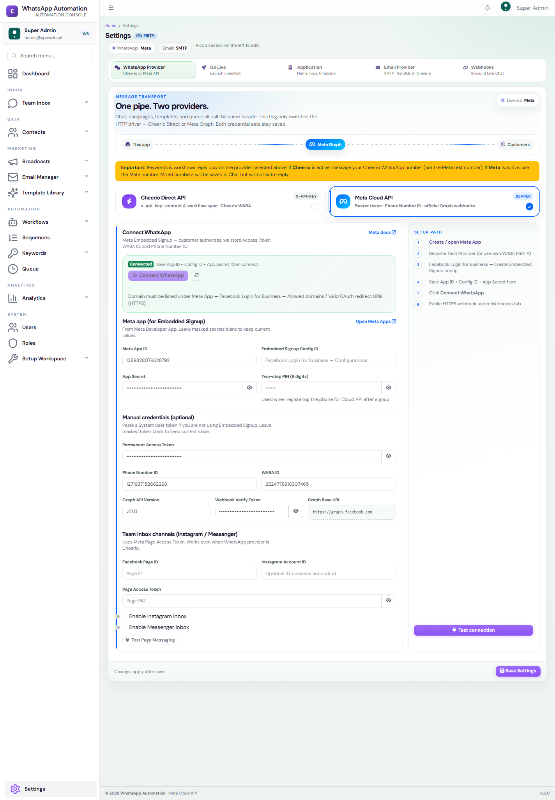
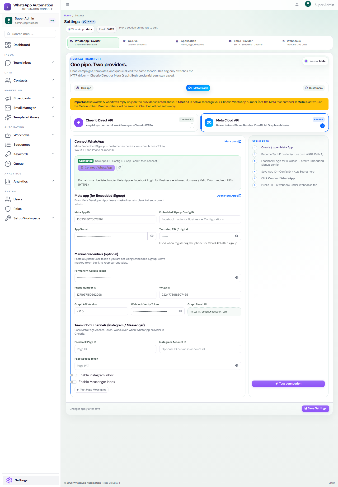
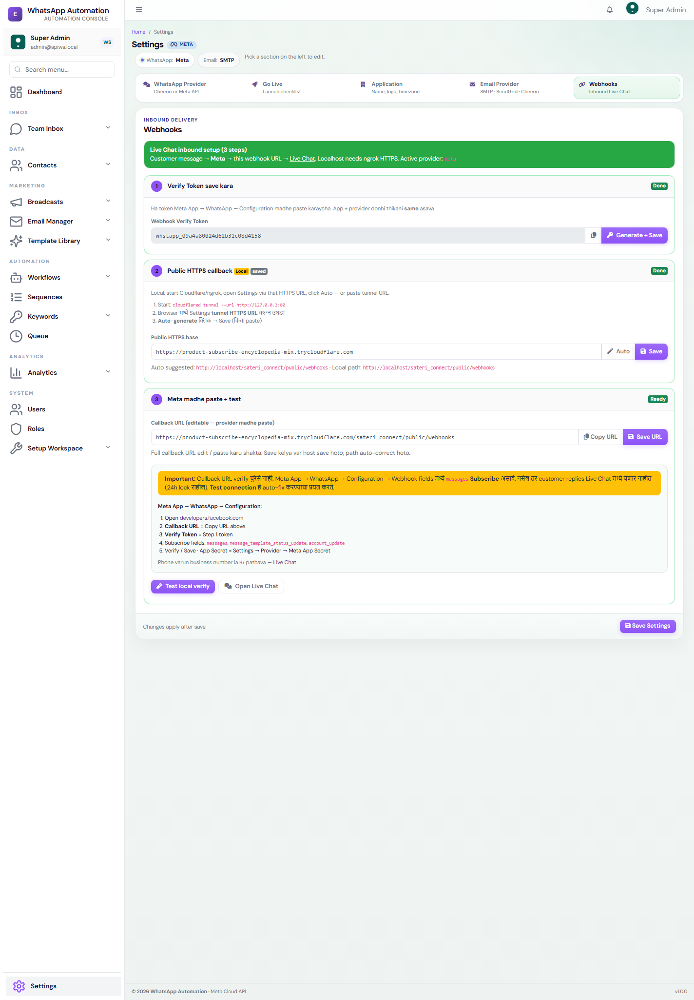
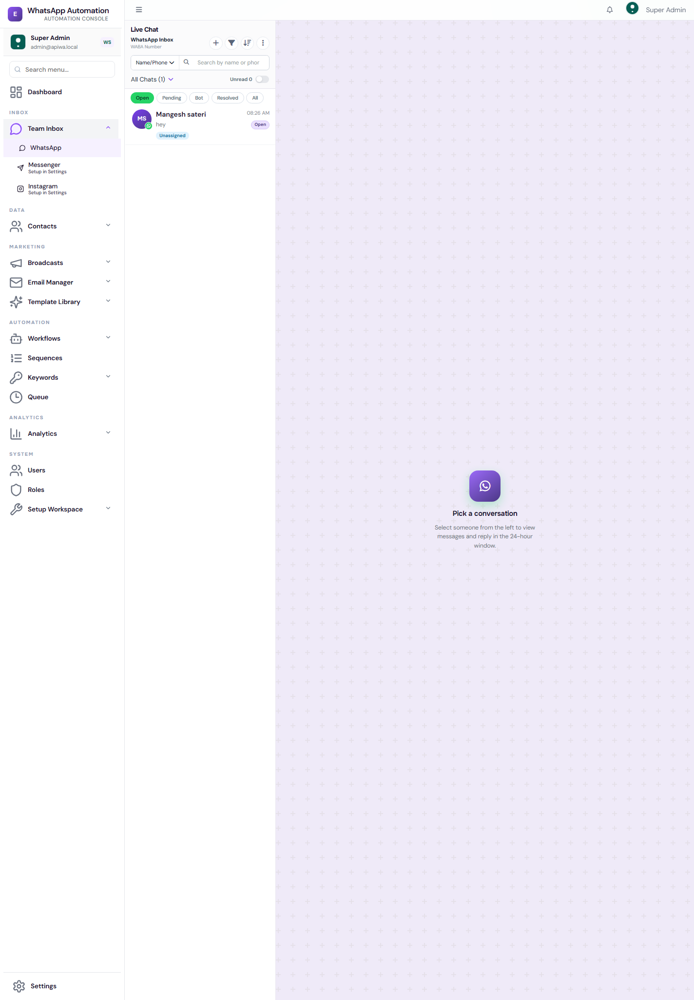
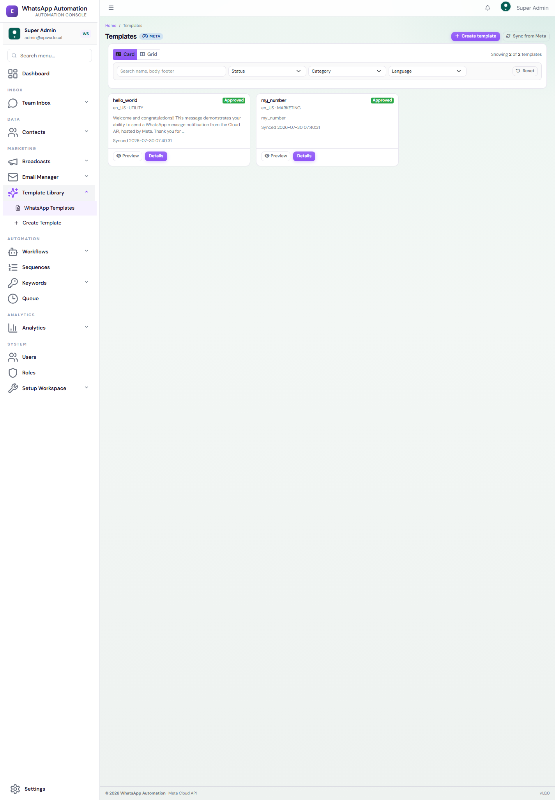
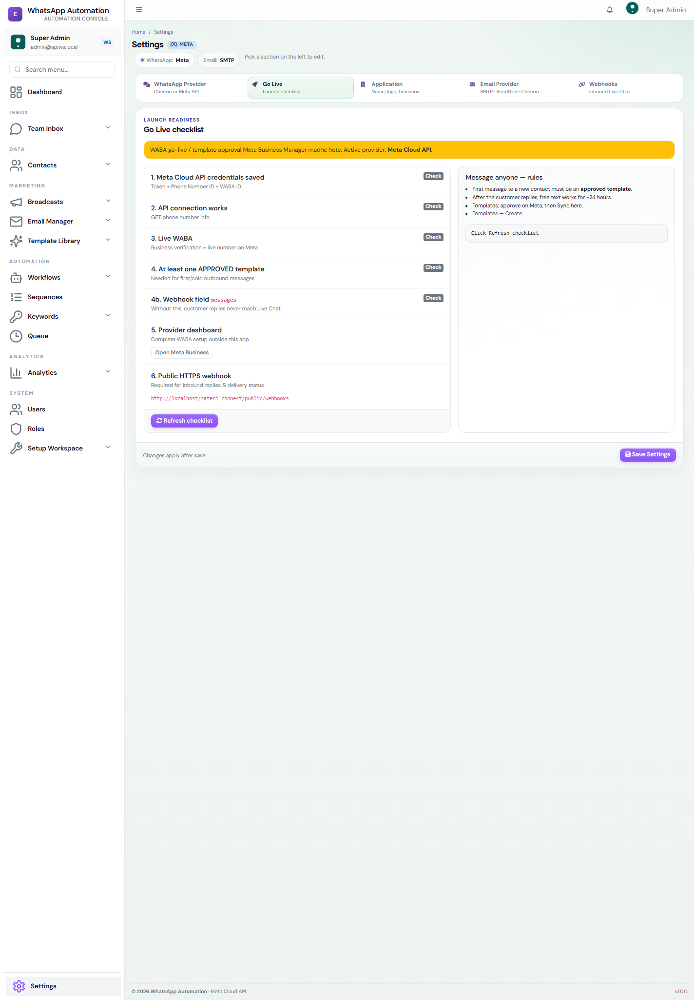

# Meta Official Guide: Developer Account to App Publish

Deep guide for taking a Meta WhatsApp setup from zero to publish/live.

This document combines:

- Meta official platform flow
- WhatsApp Cloud API onboarding requirements
- App Review / Advanced Access requirements
- Sateri Connect app-side setup
- Production checklist

Use this when you want the full journey:

`Meta developer account -> business portfolio -> app -> WhatsApp product -> test setup -> webhook -> templates -> app review -> advanced access -> live mode -> production`

> Important: Meta frequently changes button labels and dashboard layout. Follow the official links in this guide if a screen label looks slightly different.

---

## 1. Official Meta Paths

Meta has two real-world paths. Pick the correct one first.

### Path A: Direct developer / own business only

Use this when:

- you are sending WhatsApp messages only for your own business
- the WhatsApp Business Account (WABA) belongs to your business
- other external businesses are not onboarding into your app

In this path:

- Standard access is usually enough for self-use testing
- Advanced Access / App Review is often not needed for only your own business usage
- you still need a proper phone number, webhook, templates, and production token

### Path B: SaaS / Tech Provider / multi-business platform

Use this when:

- your app will onboard other businesses
- customers will connect their own WABA into your system
- you need to manage templates, messages, or webhook assets for businesses not owned by your Meta business

In this path:

- business verification is required
- App Review is required
- Advanced Access is required for the permissions your product uses
- separate explanation + video evidence is expected for each permission

For Sateri Connect, if multiple client businesses will use the product, assume **Path B**.

---

## 2. Official Meta References

Primary official docs:

- [Meta App Dashboard](https://developers.facebook.com/apps/)
- [WhatsApp Cloud API Get Started](https://developers.facebook.com/docs/whatsapp/business-management-api/get-started/)
- [WhatsApp App Review](https://developers.facebook.com/docs/whatsapp/embedded-signup/app-review/)
- [Meta Business Settings](https://business.facebook.com/settings)
- [Graph API Explorer](https://developers.facebook.com/tools/explorer)
- [Tech Provider / onboarding guidance](https://developers.facebook.com/docs/whatsapp/solution-providers/become-a-tech-provider-legacy-flow/)

Official flow, based on Meta docs:

1. Create Meta developer access
2. Create or select business portfolio
3. Create Meta app with WhatsApp use case
4. Add or connect WhatsApp Business account
5. Get test phone + temporary token
6. Send first test message
7. Configure webhook
8. Create and sync templates
9. Complete required API calls
10. Complete business verification
11. Submit App Review for Advanced Access if serving other businesses
12. Create permanent System User token
13. Switch app to Live
14. Test end-to-end in production

---

## 3. Prerequisites Before Starting

Prepare these first:

- one Meta login that can own/manage the app
- business email
- public website
- privacy policy URL
- terms of service URL if available
- business legal name and address
- support/contact email
- one phone number for WhatsApp onboarding
- production HTTPS domain or tunnel for testing webhook

If you are doing App Review later, keep these ready too:

- working prototype in Sateri Connect
- clear UI flow for send/manage actions
- test WABA and recipient number
- ability to screen-record the product flow

---

## 4. Stage 1: Create Meta Developer Access

1. Open [Meta for Developers](https://developers.facebook.com/)
2. Sign in with the Meta account that will manage the app
3. If prompted, complete developer registration
4. Accept platform terms
5. Confirm email/2FA if Meta asks

What this gives you:

- access to developer dashboard
- ability to create Meta apps
- access to app settings, products, test tokens, and Graph API Explorer

Common blockers:

- account not fully verified
- no two-factor authentication
- wrong user trying to manage business assets later

Recommendation:

- use a controlled company-owned Meta account, not a personal throwaway account

---

## 5. Stage 2: Create or Select Business Portfolio

During app creation, Meta asks you to connect a business portfolio.

Do this carefully because later permissions, WABA ownership, and business verification depend on it.

1. Open [Business Settings](https://business.facebook.com/settings)
2. Confirm business info exists
3. If no business portfolio exists, create one
4. Fill legal name, address, website, and business contact information
5. Make sure the same business will own the WABA and app if possible

Why this matters:

- App Review depends on verified business ownership
- WABA access across businesses is restricted without proper approval
- system users and permanent tokens are created under business settings

---

## 6. Stage 3: Create Meta App

Official Meta flow generally looks like:

1. Open [App Dashboard](https://developers.facebook.com/apps/)
2. Click `Create App`
3. Choose the WhatsApp-related use case, usually shown as:
   - `Connect with customers through WhatsApp`
4. Enter:
   - app name
   - app contact email
   - linked business portfolio
5. Create the app

Notes:

- older dashboards sometimes emphasize `Business` app type
- newer dashboards may be use-case driven instead of type driven
- if the dashboard offers the WhatsApp use case directly, use that

After creation, check these sections:

- App settings -> Basic
- WhatsApp -> API Setup
- Use cases / Permissions and features
- App Review

---

## 7. Stage 4: Complete Basic App Settings

Before publish or App Review, fill app basics properly.

Go to:

`App settings -> Basic`

Fill and save:

- App icon
- Privacy Policy URL
- Terms of Service URL
- Contact email
- Category
- Business use details if asked

Why this matters:

- missing privacy policy is a common publish blocker
- App Review often rejects incomplete basic metadata
- Live mode may be blocked until the basic checklist is green

---

## 8. Stage 5: Add WhatsApp Product

Inside the app:

1. Go to `Add Product`
2. Choose `WhatsApp`
3. Open `API Setup`

You typically get:

- a temporary access token
- a test phone number
- a phone number ID
- a WhatsApp Business Account ID (WABA ID)

This is the first technical checkpoint.

You need to capture these values:

- temporary token
- Phone Number ID
- WABA ID
- Graph API version you will use

Use this for initial testing only. Do not depend on temporary tokens for production.

---

## 9. Stage 6: Send First Test Message

Use the test assets shown in `WhatsApp -> API Setup`.

Normally you will:

1. add a test recipient number
2. verify that number with OTP
3. send the `hello_world` template

Important rules:

- test mode allows messages only to allowed/verified recipients
- use full international number format
- first outbound message should be template-based

Expected success:

- Meta accepts the message
- recipient receives message on WhatsApp

If send fails, usually the cause is:

- recipient not on allow-list
- wrong number format
- wrong phone number ID
- token expired

---

## 10. Stage 7: Business Verification

If your app is serving other businesses or needs App Review, complete business verification early.

Go to:

`Business Settings -> Security Center`  
or  
`Business Settings -> Business Info`

Meta may ask for:

- legal business name
- address
- phone number
- email
- website
- proof documents

Typical outcome:

- `Verified`
- `In Review`
- request for more documents

Important:

- App Review for Advanced Access usually depends on business verification
- do not wait until the end; verification can take time

---

## 11. Stage 8: Complete Official Permission/API Tests

Meta often asks for proof that the app is really using the requested permissions.

Use:

[Graph API Explorer](https://developers.facebook.com/tools/explorer)

Typical required permission tests for WhatsApp:

- `public_profile`
- `business_management`
- `whatsapp_business_management`
- `whatsapp_business_messaging`

Project-specific deep steps already exist here:

- [META_APP_REVIEW_API_TESTING.md](META_APP_REVIEW_API_TESTING.md)
- [META_WHATSAPP_PUBLISH_STEPS.md](META_WHATSAPP_PUBLISH_STEPS.md)

Typical test calls:

1. `GET me?fields=id,name`
2. `GET {WABA_ID}?fields=id,name,message_templates.limit(1)`
3. `POST {PHONE_NUMBER_ID}/messages`
4. `GET me/businesses`

Important Meta behavior:

- dashboard API-call counters may update slowly
- a successful JSON response is more reliable than a still-zero dashboard counter

---

## 12. Stage 9: Configure Webhook

Webhook is required for:

- inbound customer replies
- delivery/read statuses
- live chat updates
- reply-based automations

Meta-side flow:

1. Open the app dashboard
2. Go to `WhatsApp -> Configuration`
3. Enter:
   - Callback URL
   - Verify Token
4. Subscribe to the required field, usually `messages`

App-side flow in Sateri Connect:

1. open `Settings`
2. choose provider = `Meta`
3. set webhook verify token
4. use public HTTPS callback URL

Recommended app route:

`/webhooks`

If running locally, use a tunnel like Cloudflare Tunnel or ngrok.

---

## 13. Stage 10: Templates

Approved templates are required for:

- first outbound contact
- re-engagement outside the 24-hour service window

Template workflow:

1. create template in Meta / WhatsApp Manager
2. submit for approval
3. wait for approved status
4. sync templates into Sateri Connect
5. send template from chat or campaigns

Why this matters:

- template readiness is part of real production readiness
- App Review video for `whatsapp_business_management` often becomes stronger when template management is shown

---

## 14. Stage 11: Understand App Review Requirement

This is the key rule from Meta's official guidance:

- if you are a direct developer using the API only for your own business, App Review may not be required
- if your app will be used by other businesses, you must request Advanced Access for the permissions you need

Typical WhatsApp-related permissions for platform products:

- `whatsapp_business_messaging`
- `whatsapp_business_management`
- `business_management`

Only request permissions that your product actually uses.

Common rejection reason:

- asking for extra permissions without proving why the app needs them

---

## 15. Stage 12: Prepare App Review Evidence

Meta expects more than just Graph API success.

Prepare:

1. written explanation per permission
2. separate screen recording per permission
3. working prototype flow inside your product

### Recommended video mapping

#### `whatsapp_business_messaging`

Show:

- login to Sateri Connect
- open Live Chat or Campaigns
- send WhatsApp message
- show message received on recipient device

#### `whatsapp_business_management`

Show:

- template listing, syncing, or creation flow
- proof that your app manages customer WABA assets

#### `business_management`

Show:

- business portfolio usage in onboarding or business asset connection flow

Best practices:

- show your product UI, not only Graph API Explorer
- speak or caption what the permission is used for
- keep credentials hidden or blurred

---

## 16. Stage 13: Submit App Review / Advanced Access

Go to:

`App Review -> Permissions and features`

For each required permission:

1. click request / advanced access
2. fill justification
3. upload the right video
4. submit

Watch status under:

- App Review requests
- Use case requirement checklist

Typical timing:

- a few days to a couple of weeks

If rejected:

- read the exact reason
- fix the gap
- re-record proof if needed
- resubmit only the permissions actually needed

---

## 17. Stage 14: Create Permanent System User Token

Never use temporary testing tokens in production.

Go to:

`Business Settings -> Users -> System Users`

Then:

1. create system user
2. assign assets:
   - Meta app
   - WABA
3. generate token for the app
4. select required permissions
5. store it securely

Typical production permissions:

- `whatsapp_business_messaging`
- `whatsapp_business_management`
- `business_management`

Important:

- tokens created before approval may not include newly approved scopes
- after approval, refresh/regenerate production token

---

## 18. Stage 15: Switch App to Live

Before switching to Live:

- business verification complete
- required app settings complete
- App Review approvals done if applicable
- permanent token ready
- webhook verified
- template send works

Then:

1. open App Dashboard
2. change app mode from Development to Live
3. re-test using production credentials

Do not switch too early if the review checklist is still incomplete.

---

## 19. Stage 16: Configure Sateri Connect for Production

In Sateri Connect:

1. `Settings -> WhatsApp Provider`
2. choose `Meta`
3. save:
   - Access Token
   - Phone Number ID
   - WABA ID
   - API Version
   - Webhook Verify Token
4. run `Test Meta Connection`
5. set webhook callback on Meta side
6. sync templates
7. send real template
8. test inbound reply in Live Chat

---

## 20. Suggested End-to-End Sequence

Recommended order:

1. developer account ready
2. business portfolio selected
3. Meta app created
4. app basic settings completed
5. WhatsApp product added
6. test recipient verified
7. first test template message works
8. business verification started/completed
9. Graph API permission calls completed
10. webhook verified
11. templates approved and synced
12. App Review videos recorded
13. Advanced Access submitted
14. permanent token created
15. app set to Live
16. production test in Sateri Connect

---

## 21. Common Mistakes

1. Using temporary token in production
2. Not verifying recipient in test mode
3. Using wrong path for message send
4. Requesting unnecessary permissions
5. Recording videos that only show Graph API Explorer
6. Missing privacy policy URL
7. Delaying business verification until the end
8. Forgetting to regenerate token after approvals
9. No webhook, then expecting inbound chat to work
10. No approved template, then expecting cold outbound messages to work

---

## 22. Screenshots in This Project

Use these internal screenshots while following the process:

### Meta Connect WhatsApp

### Sateri Connect Meta Settings

### Webhooks Setup

### Live Chat Validation

### Templates Sync

### Go Live Checklist

---

## 23. Production Readiness Checklist

- [ ] Meta developer access ready
- [ ] business portfolio selected correctly
- [ ] app created with WhatsApp use case
- [ ] app basic settings completed
- [ ] WhatsApp product added
- [ ] test recipient verified
- [ ] test send successful
- [ ] business verification completed
- [ ] Graph API required calls completed
- [ ] webhook verified
- [ ] `messages` subscription active
- [ ] approved templates available
- [ ] App Review submitted if multi-business
- [ ] Advanced Access approved
- [ ] permanent System User token generated
- [ ] app switched to Live
- [ ] Sateri Connect provider set to Meta
- [ ] outbound template send tested
- [ ] inbound reply tested

---

## 24. Related Project Docs

- [META_APP_REVIEW_API_TESTING.md](META_APP_REVIEW_API_TESTING.md)
- [META_WHATSAPP_PUBLISH_STEPS.md](META_WHATSAPP_PUBLISH_STEPS.md)
- [META_PUBLISH_GO_LIVE.md](META_PUBLISH_GO_LIVE.md)
- [META_PROVIDER_SETUP_GUIDE.md](META_PROVIDER_SETUP_GUIDE.md)
- [PROVIDER_SETUP_GUIDE.md](PROVIDER_SETUP_GUIDE.md)

---

## 25. Final Recommendation

If the goal is only your own business messaging, keep the setup lean:

- direct Meta setup
- permanent token
- webhook
- templates
- live number

If the goal is a customer-facing SaaS onboarding many businesses, build for review-readiness from day one:

- verified business
- clean onboarding flow
- strong permission justifications
- separate review videos
- production-safe token and webhook design
